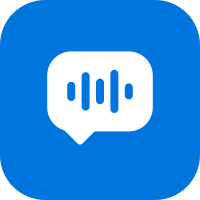

  

<h1 align="center">Glog (글로그)</h1>

말은 글로, 글은 기록으로

<a href="https://glognote.com">glognote.com</a>

---

Glog는 수업과 회의를 실시간으로 받아쓰고, 번역하고, 요약하는 서비스입니다.

## 기능

- **실시간 받아쓰기** - 말하는 동안 문장이 바로 글로 쌓입니다. 놓친 부분은 시간대를 눌러 다시 들을 수 있습니다.
- **자동 번역** - 문장마다 번역이 바로 아래에 붙습니다. 원문과 번역을 나란히 보며 따라갈 수 있습니다.
- **AI 요약** - 녹음을 멈추면 핵심과 결정 사항을 정리합니다. 기록에 대고 궁금한 것을 물어볼 수도 있습니다.
- **맥락 학습** - 폴더마다 전문 용어를 익혀 인식 정확도를 높입니다.
- **보관함** - 기록을 폴더별로 저장하고 다시 찾아볼 수 있습니다.

## 사용 방법

1. 저장할 폴더와 언어를 고르고 녹음을 시작합니다.
2. 받아쓰기와 번역이 실시간으로 쌓입니다. 중요한 문장은 표시해 두고 나중에 모아 볼 수 있습니다.
3. 녹음을 멈추면 기록이 폴더에 저장되고 요약이 만들어집니다.

## 맥락 학습

과목이나 분야마다 쓰는 용어가 다릅니다. 폴더에 분야와 용어를 정해 두면, 그 폴더에 녹음할 때 용어 목록이 음성 인식과 번역에 함께 쓰입니다.

- 분야를 고르면 자주 나오는 용어가 먼저 채워집니다.
- 강의 자료(PDF, TXT)를 올리면 용어를 뽑아 더합니다.
- 같은 계정이면 어느 기기에서든 같은 맥락이 적용됩니다.

## 번역

말하는 언어와 번역할 언어를 고르면 문장마다 번역이 붙습니다. 원어 강의나 해외 팀과의 회의도 원문과 번역을 함께 남길 수 있고, 저장된 기록에서는 원문만 또는 번역만 골라 볼 수 있습니다.

## 이런 때 씁니다

- **수업** - 강의, 세미나, 스터디. 필기 대신 설명에 집중할 수 있습니다.
- **회의** - 주간 회의, 고객 미팅, 원격 회의. 끝나면 결정 사항이 정리됩니다.
- **인터뷰** - 취재, 사용자 인터뷰, 상담. 인용할 문장을 표시해 두면 바로 찾을 수 있습니다.

## 시작하기

[glognote.com](https://glognote.com)에서 가입하면 바로 쓸 수 있습니다. 매달 무료 사용량이 주어집니다.

---

# Glog

Real-time transcription, translation and summaries for lectures and meetings.

- **Live transcription** - Sentences appear as you speak. Tap a timestamp to replay what you missed.
- **Translation** - Each sentence gets its translation right below it.
- **AI summaries** - Key points and decisions are organized when recording stops.
- **Context learning** - Set a field and terms per folder, or upload lecture files (PDF, TXT) to extract terms, for more accurate transcription.
- **Library** - Recordings are saved by folder and available on any device.

Start at [glognote.com](https://glognote.com).
